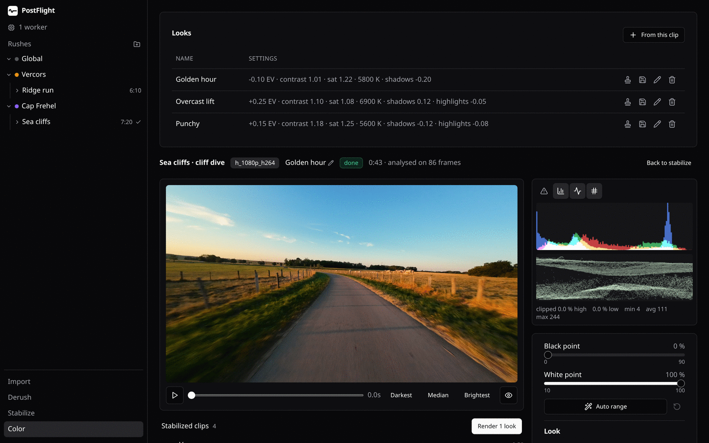
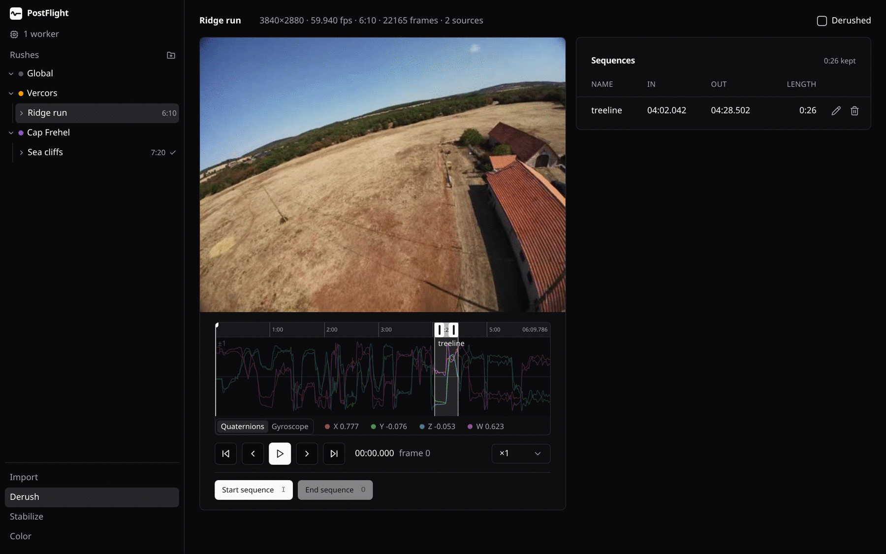
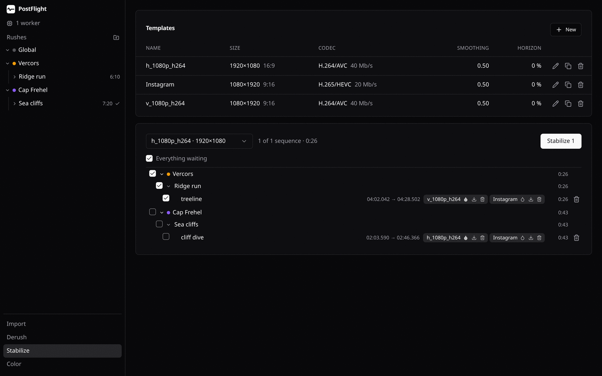
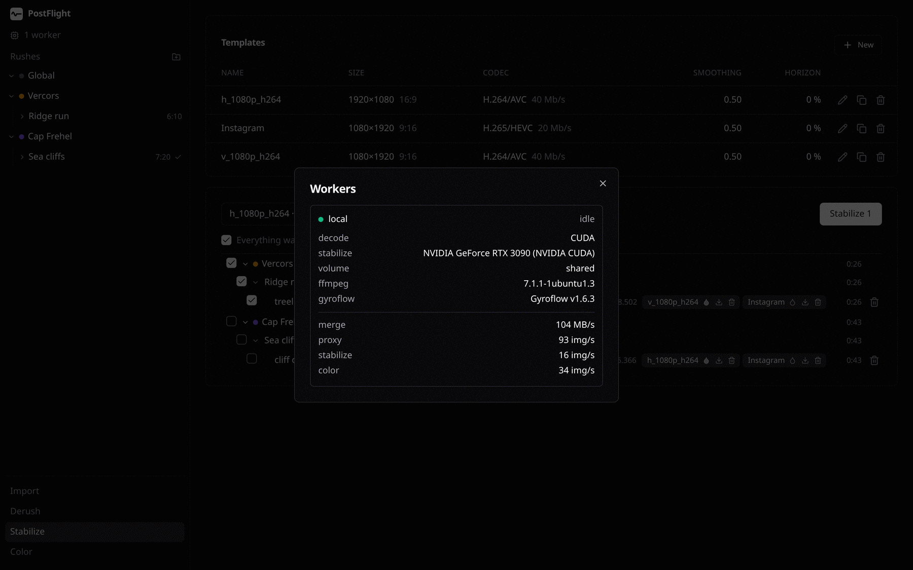

<div align="center">

<picture>
  <source media="(prefers-color-scheme: dark)" srcset="docs/logo-dark.svg">
  
</picture>

# PostFlight

**From the SD card to a stabilized, graded clip.**

A web pipeline for DJI FPV footage. It picks up your rushes, joins the parts the camera
split, lets you mark the moments worth keeping, stabilizes them with Gyroflow and grades
them, and it does all of that without ever destroying the gyro track. Self-hosted, two
Docker images, and it spreads the heavy jobs over as many machines as you point at it.

[](https://github.com/Okhr/postflight/actions/workflows/build.yml)
[](https://github.com/Okhr?tab=packages&repo_name=postflight)
[](https://gyroflow.xyz)
[](#which-cameras)
[](LICENSE)



</div>

## Quick start

```bash
git clone https://github.com/Okhr/postflight.git && cd postflight
cp .env.example .env          # set PF_DATA_PATH and PF_PORT
docker compose up -d
```

Open `http://localhost:8080`, drag your rushes into the drop zone, and the pipeline takes
it from there. Everything below is optional: the GPU, the extra machines, the tuning.

Got a GPU? One override, once, and stabilization gets about three times faster:

```bash
docker compose -f docker-compose.yml -f docker-compose.nvidia.yml up -d   # NVIDIA
docker compose -f docker-compose.yml -f docker-compose.gpu.yml up -d      # AMD or Intel
```

## Why it exists

A four minute FPV flight lands on your card as two files, 4 GB each, with the gyro
telemetry the camera recorded folded into a private `djmd` stream. Everything you would
normally reach for destroys that stream, and you only find out when the stabilizer tells
you there is nothing to stabilize.

```
inbox/     watched folder, or the browser drop zone
  |        ingest: size settles, ffprobe, content fingerprint
raw/       untouched masters, never re-encoded, never cut
  |        the parts of one flight are joined losslessly (mp4_merge, gyro kept)
merged/    one continuous file per flight
  |        an H.264 proxy the browser can scrub, plus the gyro curve
proxies/   what you actually watch while marking keepers
  |        in and out marks, stored as frame numbers
out/       Gyroflow renders: one pass, only the parts you kept
  |        grading: a second encode, only on the clips that survived
graded/    H.264 clips, ready to share
```

Three decisions carry the whole thing:

**ffmpeg can neither join nor cut a DJI rush without killing the gyro.** The `djmd`
stream has codec `none`, which mp4 refuses (`Could not find tag for codec none`) and mkv
refuses too. So joining goes through [`mp4_merge`](https://github.com/gyroflow/mp4-merge),
the same tool Gyroflow uses internally: it rewrites the sample table and keeps every
track. 4.4 s for 4 GB.

**Marking keepers stays metadata.** No master is ever cut. The in and out marks are handed
to Gyroflow as `trim_ranges_ms`, so there is exactly one heavy pass, on the parts you
kept, with no multi-gigabyte intermediate on the way.

**Joining happens before stabilizing, never the other way round.** Smoothing and adaptive
zoom are computed over the whole gyro curve. Two halves stabilized separately leave a
visible seam at the junction.

## The four steps

|  |  |
|---|---|
| **1 Import** | Drop rushes in the browser, or copy them into the watched folder. Split recordings are detected and joined, duplicates are recognised by content and set aside, and a proxy is built. |
| **2 Derush** | Scrub the proxy frame by frame with the gyro curve under it, and mark the sequences worth keeping. Nothing is cut, and nothing is saved by hand. |
| **3 Stabilize** | One queue for every rush, three-state checkboxes, a render profile at the top. Sequences already rendered with that profile are struck out, so a second format never redoes work. |
| **4 Color** | Six sliders and two range points, a GPU preview that follows the slider while it moves, four scopes, and a library of looks you can paint onto other clips. |

<table>
<tr>
<td width="50%"></td>
<td width="50%"></td>
</tr>
<tr>
<td><b>Derush.</b> The gyro curve under the player is where the calm passes and the shakes
are, reconstructed from 2000 orientation samples a second.</td>
<td><b>Stabilize.</b> One queue across every folder and rush, rather than one launcher per
rush.</td>
</tr>
</table>

## Deployment

### The GPU, machine by machine

One image carries the drivers for all three vendors. What it cannot guess is **how Docker
hands the GPU over**, because that is decided at the daemon level and not in the
application. Hence one override to pick once:

| host | command | what it gives |
|---|---|---|
| no GPU | nothing to add | everything on the CPU, the stack still runs |
| **AMD / Intel** | `-f docker-compose.yml -f docker-compose.gpu.yml` | `/dev/dri` mapped (set `PF_RENDER_GID` from `getent group render`) |
| **NVIDIA** | `-f docker-compose.yml -f docker-compose.nvidia.yml` | the nvidia runtime, needs `nvidia-container-toolkit` on the host |

Put the matching `COMPOSE_FILE` line in your `.env` and every later `docker compose up`
applies it on its own. That avoids the classic "up without the `-f`", which quietly
recreates the containers with no GPU.

It is worth the trouble. Measured on an RTX 3090, on a high bitrate 3840x2880 HEVC 10-bit
source, decoding goes from 0.33x to **1.40x** realtime on NVDEC, and the whole proxy pass
from 0.31x to **1.37x**. The gain grows with the bitrate, because decoding dominates:
accelerate it and the proxy encode costs almost nothing next to it.

Getting it wrong is never fatal, only slow. **No accelerated path is taken on trust**: at
startup the worker really decodes an HEVC 10-bit sample on NVDEC and then on VAAPI and
keeps the first that works, and it enumerates actual OpenCL devices instead of counting
installed drivers. Whatever fails is not used, and the interface says what was picked, and
why it fell back when it did.

That caution was expensive to learn. On a machine whose NVIDIA kernel module and userspace
were on the same version, with `/dev/nvidia*` present and `nvidia-smi` answering
perfectly, `cuInit()` returned `CUDA_ERROR_UNKNOWN`, on the host, outside any container.
Every static clue said "GPU ready".

### Two images out of one Dockerfile

`postflight-api` is the dispatcher, and it also serves the interface. `postflight-worker`
is what does the work. The API decodes nothing, warps nothing and joins nothing, so it
carries no OpenCL, no Vulkan and no Gyroflow: **656 MB against 1.99 GB**. It keeps ffmpeg,
which the grading analysis needs. The GPU overrides therefore only ever apply to workers.

**Portainer**: paste `docker-compose.yml` as a stack, add the section from the override
that matches your hardware, and fill in the variables from `.env.example`.

### Adding a machine

One more worker, on any other machine, in one command:

```bash
PF_API_URL=http://192.168.1.104:8080 PF_WORKER_NAME=desktop \
  docker compose -f docker-compose.remote-worker.yml up -d
```

Nothing to open on that side and nothing to discover: **the worker dials out**, announces
itself and asks for work, and the dispatcher never calls back. Give it the same GPU
override as the main stack. The name has to be stable, because it is what ties everything
its real jobs measured to that machine.

Its volume is a **work volume**, not the dispatcher's. It holds only what this machine
needed. The worker notices which case it is in on its own: the API stamps its data
directory with a uuid, the worker sends back the one it can read, and equality is the
whole test. Inputs then arrive over HTTP and outputs go back the same way, with a cache so
a second cut of the same flight transfers nothing, evicting its oldest footage to stay
under `PF_WORKER_CACHE_BYTES`.



**The dispatcher decides where every job goes, and never asks.** Each worker measures its
four throughputs at startup by running the four real steps on half a second of rush baked
into the image (4.4 s in total), and the dispatcher compares `magnitude / rate + transfer
/ link`. That yields the decisions you would want: a join stays on the machine that can
see the volume, because moving 4 GB costs ten times more than the join itself, and a
render goes to the machine that already holds the master. Those rates do not stay
estimates either, every finished job corrects them (measured: 28.0 img/s claimed by the
benchmark, 24.9 img/s after two real renders).

Something that fell out of measuring rather than assuming: **a Gyroflow render is bound by
the CPU, not by the GPU**. On an RTX 3090 the warp really does run on OpenCL, and the
container still sits at 676% of 800% CPU while the GPU idles at 13%. Which is why that
RTX 3090 renders at the same speed as a Radeon 890M iGPU. "Send the renders to the machine
with the big GPU" is simply the wrong model, and only a real throughput measurement
settles it.

### The data volume, and where the database goes

One bind mount, `/data`. Keep `inbox/` and `raw/` **on the same filesystem**: ingestion is
then an instant `rename()` instead of a multi-gigabyte copy. Budget about 2x the size of
your footage while `PF_PURGE_PARTS_AFTER_MERGE` is `false` (masters plus joined files),
plus roughly 8 Mb/s of proxy.

The footage is happy on a NAS share. **The `db/` directory is not.** SQLite runs in WAL
mode, which needs a shared-memory file that network filesystems do not provide. If `/data`
is an NFS or SMB mount, give the database a local disk:

```yaml
services:
  api:
    volumes:
      - /mnt/nas/footage:/data
      - ./db:/data/db          # a local disk, on the machine running the API
```

## Configuration

Everything is an environment variable with a `PF_` prefix, and `.env.example` documents
each one where it is defined. The ones that matter on day one:

| variable | default | what it is |
|---|---|---|
| `PF_DATA_PATH` | `./data` | the host directory behind `/data` |
| `PF_PORT` | `8080` | where the interface listens |
| `PF_UID` / `PF_GID` | `1000` | who owns the files written to `/data` |
| `PF_HWACCEL` | `auto` | `auto` probes NVDEC then VAAPI by really decoding a sample; `cuda`, `vaapi` or `cpu` pins one |
| `PF_WORKER_NAME` | `local` | a worker's identity, and it has to be stable |
| `PF_WORKER_TOKEN` | empty | shared secret on the worker endpoints. Empty leaves them open, which is fine on a LAN and only there |
| `PF_PURGE_PARTS_AFTER_MERGE` | `false` | delete the parts once they are joined. The join is lossless, the deletion is not undoable |

## Render profiles

A profile is a **partial Gyroflow project** (`data/templates/*.json`) passed as `--preset`,
so what you validated in Gyroflow itself is what runs here. Two ship with the app, both
editable in the interface without rebuilding anything:

| id | output | framing |
|---|---|---|
| `h_1080` | 1920x1080 | 16:9 crop out of the 4:3 source |
| `v_1080` | 1080x1920 | 9:16 crop, with an adjustable offset |

Seven of Gyroflow's ninety settings are exposed: dimensions, codec, bitrate, smoothness,
horizon lock, lens correction, FOV and the framing offset on both axes. The rest is left
where Gyroflow puts it, and a save **patches** the file rather than rewriting it, so
anything the form does not show survives. The generated project is kept in `projects/`,
which means every render can be replayed exactly.

## FAQ

#### Which cameras?

Built and measured on **DJI O3 and O4 / O4 Pro** goggles recordings, in all three naming
schemes DJI has used, including the old `DJI_0327.MP4` that carries no timestamp at all.
Anything Gyroflow can read should render; what is DJI-specific here is the split detection
and the gyro chart.

#### Do I need a GPU?

No. Everything falls back to the CPU and the stack runs. A GPU roughly triples the
stabilization pass and helps the proxy a lot on high bitrate footage.

#### Can it run on a NAS or a small VM?

Yes, and that is a good place for the **dispatcher**, which hands work out rather than
doing it. Put the heavy workers on machines with a decent CPU (see above: the render is
CPU bound), point them at it with `PF_API_URL`, and the dispatcher routes around the slow
ones on its own.

#### Does it re-encode my masters?

Never. Masters land in `raw/` and are only ever read. Joining is lossless. Everything else
is written as a new file next to them.

#### What if two flights get glued together, or one flight gets split in two?

Grouping is automatic and has no manual override, on purpose. Two parts wrongly separated
are fixed by deleting both sequences, which frees their clips and lets the next scan
regroup them. Two unrelated flights wrongly glued have no recourse, which is why the gap
tolerance is tight: measured over 179 consecutive pairs of a real collection, the 51
genuine splits all follow within 0.79 s and the nearest unrelated flight is 1.11 s behind.

#### Is there authentication?

No. Put it behind a reverse proxy if it leaves your LAN, and set `PF_WORKER_TOKEN` on both
sides. Note that uploads are single requests of several gigabytes: nginx defaults to
**1 MB** (`client_max_body_size 0;` lifts it) and Cloudflare's orange proxy caps at
**100 MB** with no way around it outside Enterprise. For dropping rushes from the browser,
reach the app directly on the LAN or through a tunnel like Tailscale.

## Development

```bash
python3 -m venv .venv && .venv/bin/pip install -r backend/requirements.txt
cd backend && PF_DATA_DIR=../data ../.venv/bin/uvicorn app.main:app --port 8000
PF_DATA_DIR=../data ../.venv/bin/python -m app.worker

cd frontend && npm install && npm run dev    # proxies /api to port 8000
```

Running locally needs `mp4_merge` on the `PATH` (or `PF_MP4_MERGE_BIN`); prebuilt binaries
are on the [mp4-merge releases](https://github.com/gyroflow/mp4-merge/releases). Tests are
`pytest -q` from `backend/`; a handful of them run a real ffmpeg and skip themselves
without one.

The interface is React, Vite, Tailwind and base shadcn/ui components. The backend is
FastAPI, SQLModel and SQLite. Code, comments and interface text are in English.

## License

[Apache License 2.0](LICENSE). Use it, fork it, ship it; the patent grant and the
attribution requirement come with it.

## Credits

Standing on [Gyroflow](https://gyroflow.xyz) and its
[telemetry-parser](https://github.com/AdrianEddy/telemetry-parser), which is what reads
DJI's `djmd` stream in the first place, [mp4-merge](https://github.com/gyroflow/mp4-merge),
[ffmpeg](https://ffmpeg.org) and [shadcn/ui](https://ui.shadcn.com).
